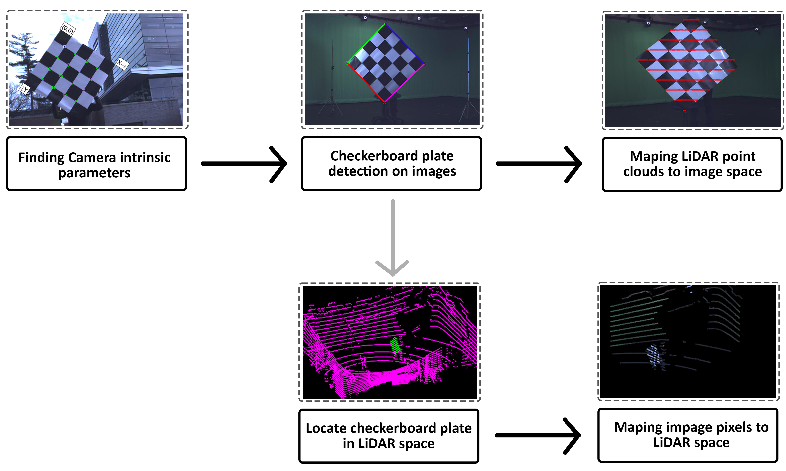

# camera-lidar-calibration

## How algorithm works?
The below figure illustrates calibration steps.

## How to use?
First make sure that you have installed `LiDAR Toolbox`. Then you can use different `.m` files based on your application. You have following options:
1. Search through point clouds Frames: When you are using low resolution LiDAR, it can be challenging to find checkerboard patterns. (Due to the low spatial resolution). So make sure that you are recording multiple frame for each angle and use this code to make sure that in the calibration process, you are using the right frames. 
2. read pcap and save Pcd: using this code you can read pcap files, and store all frames in `.pcd` format. This is useful as `VeloView` software usually stores data in `.pcap` format.
3. Camera-LiDAR calibration (main2.m): this function helps you to calculate transformation matrix. It includes all steps of our paper. Make sure that you are using `Camera Calibrator` to calculate camera intrinsic parameters first. 
4. Project point cloud to image space: using this code you can project LiDAR point clouds to the image space using the calculated transformation matrix. Clearly, you should do calibration first to have this matrix.

